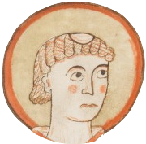

<h1>
  
  Bede
</h1>
A simple theme, dedicated to the Venerable Bede, father of English history.
```
Fore thaem neidfaerae ‖ naenig uuiurthit
thoncsnotturra, ‖ than him tharf sie
to ymbhycggannae ‖ aer his hiniongae
huaet his gastae ‖ godaes aeththa yflaes
aefter deothdaege ‖ doemid uueorthae.
```